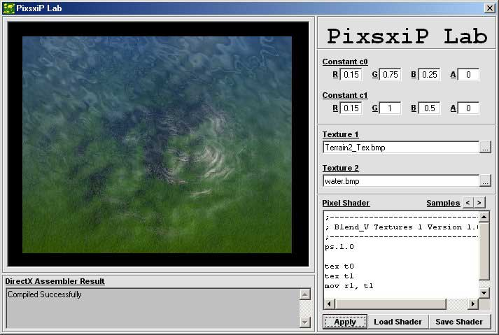



## PixsxiP Lab \(DX 8 Pixel Shader Lab\) First On PSC\! \(UPDATED\)

### Description

This program will let you program Pixel Shaders. The program its self is pretty easy, but programming pixel shaders is kind of tough. Considering it is asm. I made it so I could learn Pixel Shaders for my RPG game, to get rid of the seams in the textures. It comes with 13 shader examples (Samples button). In version 2 I want to make it more user friendly and try to make it easier to understand the functions. Please leave some comments and if you like it, please vote.
 
### More Info
 

             |
---                |---
**Submitted On**   |2002-07-24 17:31:08
**By**             |[James Dougherty](https://github.com/Planet-Source-Code/PSCIndex/blob/master/ByAuthor/james-dougherty.md)
**Level**          |Advanced
**User Rating**    |5.0 (15 globes from 3 users)
**Compatibility**  |VB 6\.0
**Category**       |[DirectX](https://github.com/Planet-Source-Code/PSCIndex/blob/master/ByCategory/directx__1-44.md)
**World**          |[Visual Basic](https://github.com/Planet-Source-Code/PSCIndex/blob/master/ByWorld/visual-basic.md)
**Archive File**   |[PixsxiP\_La1101167242002\.zip](https://github.com/Planet-Source-Code/james-dougherty-pixsxip-lab-dx-8-pixel-shader-lab-first-on-psc-updated__1-37199/archive/master.zip)

